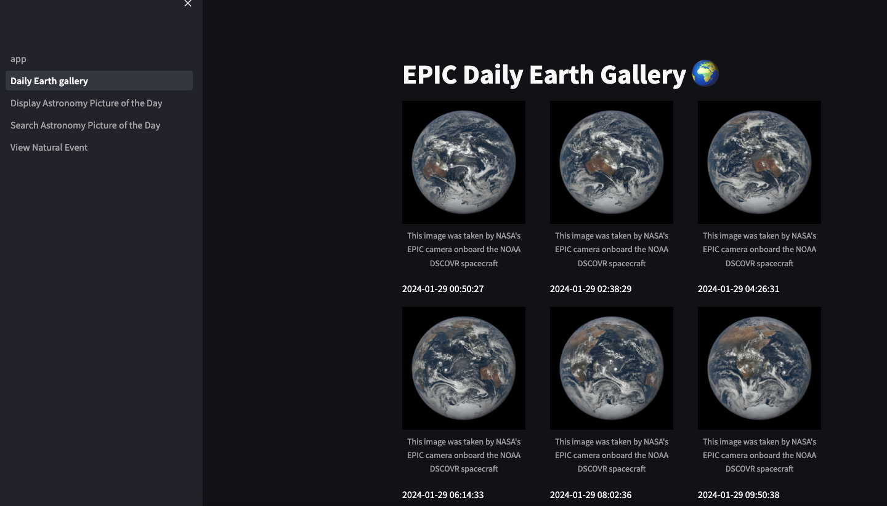
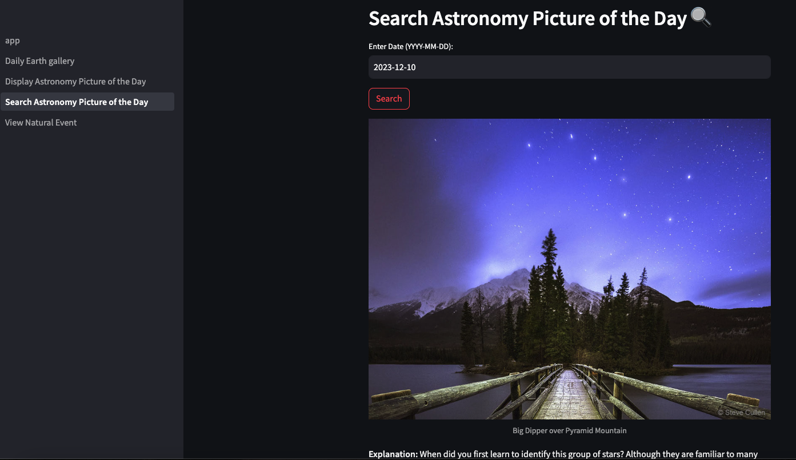
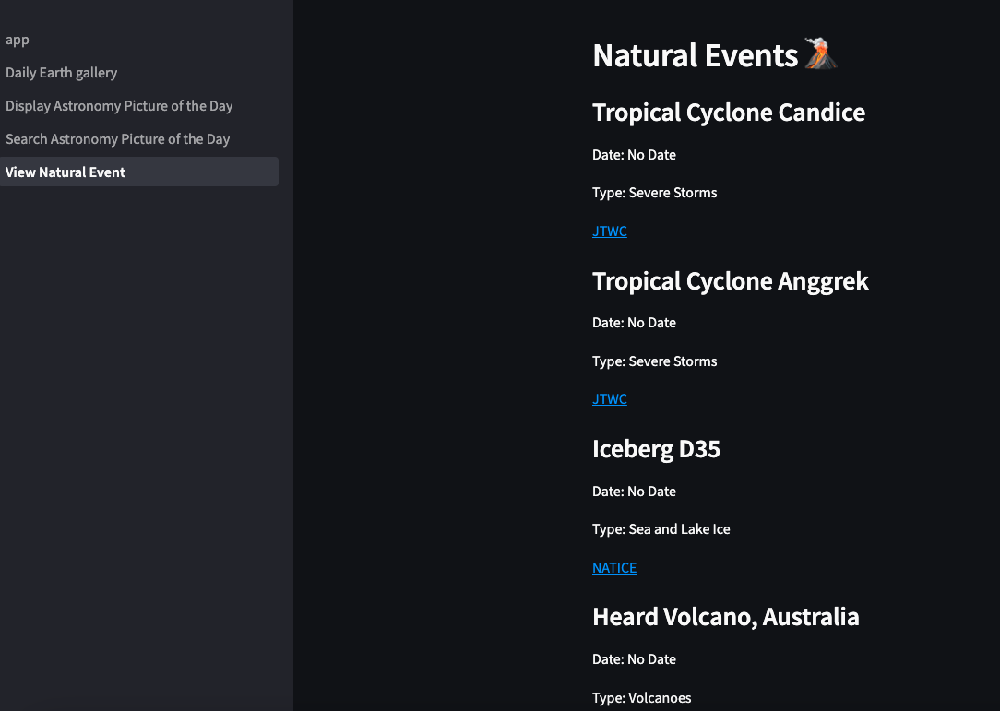

# CS5001 Final Project
## Cosmic Explorer 🔭
A NASA Data Visualization App designed for NASA lovers and scholars.

### Libraries Implemented
- `streamlit`
- `unit test`
- `requests`

### Streamlit Installation
1. Set up Python development environment.
2. Run:
   `pip install streamlit`
3. Validate the installation by running Hello app:
   `streamlit hello`

### Run Streamlit application
`python3 -m streamlit run app.py`

### View

### More information
Find in `Project report.md` & 
[Streamlit Library](https://docs.streamlit.io/library/api-reference)
